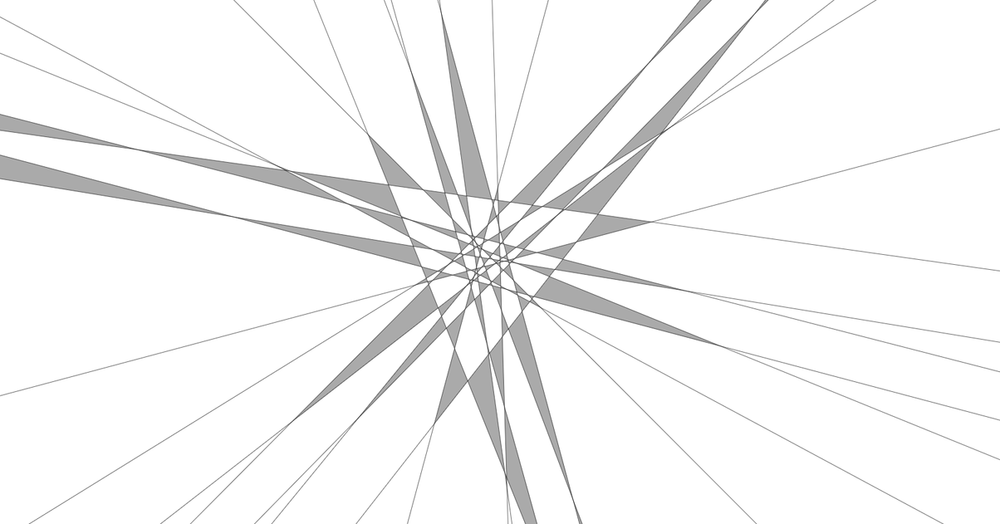
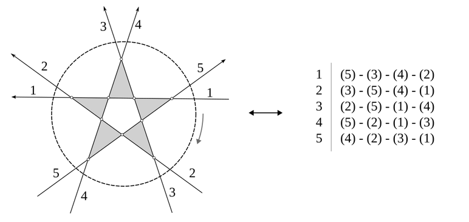
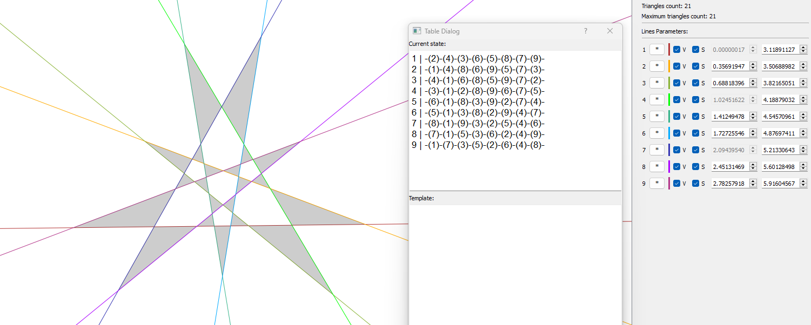
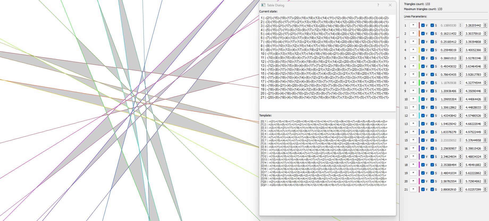

# Kobon Triangle Problem (21 lines, 133 triangles)

This repository provides an optimal solution for the Kobon Triangle Problem when using 21 lines. The Kobon Triangle Problem is a combinatorial geometry puzzle that involves finding the maximum number of non-overlapping triangles that can be formed using a given number of straight lines [(wikipedia)](https://en.wikipedia.org/wiki/Kobon_triangle_problem).

* [Raw Lines (TXT-file)](./n21_lines.txt)
* [HTML Preview](https://zegalur.github.io/kobon-21/n21_prev.html)

## How It Was Constructed

By enclosing all the intersection points inside a large circle and numbering all `n` lines clockwise, each arrangement can be represented by a corresponding table:

Studying the properties of these tables enabled the creation of an algorithm to find optimal tables for arrangements that match the upper-bound approximations for various `n`, including `n=21`. 
After identifying the optimal table, the final arrangement was manually constructed using a specially-made editor.

Here is how the editor looks for `n=9`:

And here it is for `n=21`:

## Other Important Results

The algorithm couldn't find any table for `n=11` with `33` triangles. 
Therefore, the current best-known solution with `32` triangles is optimal, although this result has never been published nor independently verified.

## References

* [Kobon triangle problem (Wikipedia)](https://en.wikipedia.org/wiki/Kobon_triangle_problem)
* [G. Clément and J. Bader. Tighter Upper Bound for the Number of Kobon Triangles. Draft Version, 2007](https://web.archive.org/web/20171111045109/http://www.tik.ee.ethz.ch/sop/publicationListFiles/cb2007a.pdf)

*Pavlo Savchuk 2024*
